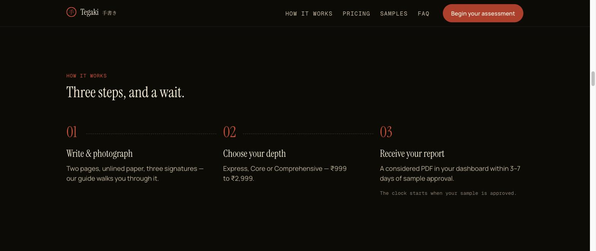
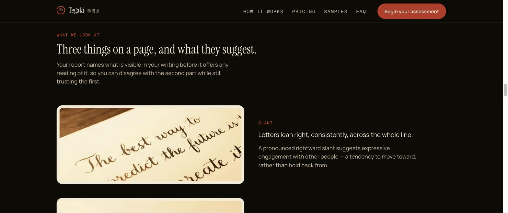
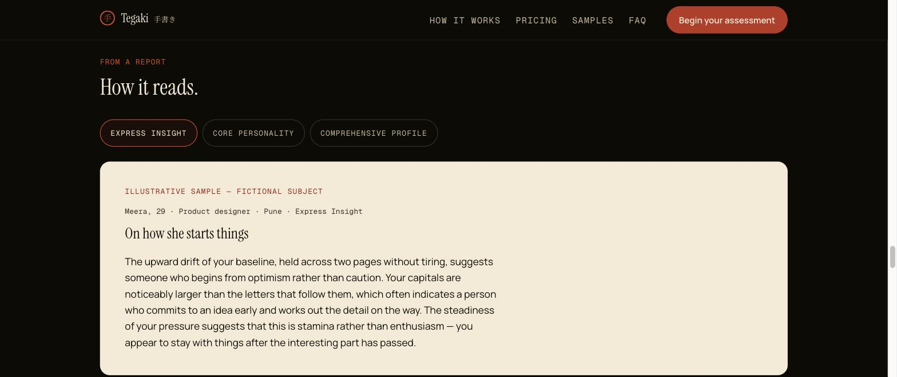
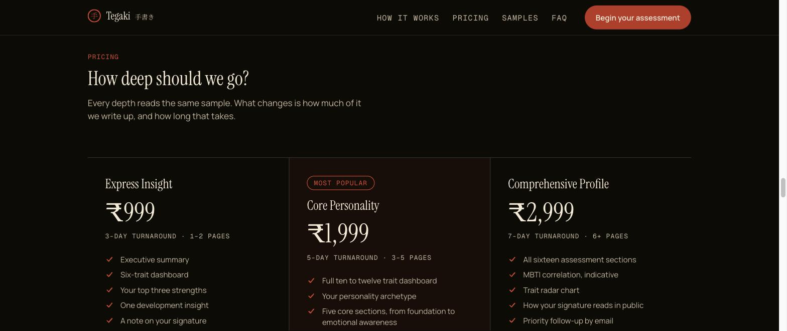
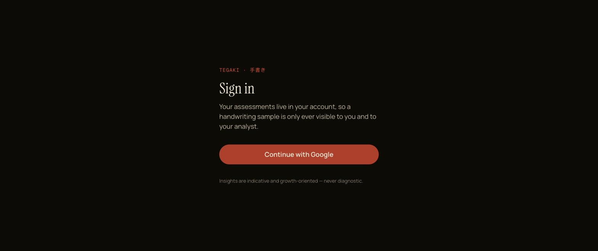

<p align="center">
  
</p>

<p align="center"><strong>What your handwriting suggests about you — read and written by hand.</strong></p>
<p align="center">A personal, growth-oriented handwriting assessment: write two pages, photograph them, choose a depth, and receive a considered PDF report. Pilot programme from ₹999.</p>

<p align="center">
  
  
  
</p>

---

**Tegaki** (手書き, Japanese for *handwritten*) is a small, self-hosted web app for running a handwriting
personality assessment as a service. A visitor writes a couple of pages by hand, photographs them, picks how
deep a reading they want, and — after a human analyst reviews the sample — receives a written report in their
own private dashboard. The whole product is built around one promise it keeps mechanically: readings are
**indicative and growth-oriented, never a diagnosis or a prediction**. It runs as a pilot, so the checkout
confirms an order without charging for it.

## Highlights

- **Guided assessment wizard** — a four-stage flow (choose a tier → whose handwriting → upload the sample →
  confirm) that is server-gated on `orders.wizard_stage`, so you can't deep-link past a step you haven't
  finished.
- **Sample guardrails** — four things must be ticked (unlined paper, at least two pages, three signatures,
  something you wrote yourself) before the dropzone unlocks; the same 20 MB / JPEG·PNG·PDF limits are enforced
  in the browser, the server action, *and* the database `CHECK` constraints.
- **Private accounts** — Google sign-in via Supabase Auth; every order, sample and report is scoped to the
  buyer, so a handwriting sample is only ever visible to its owner and the analyst.
- **Row-Level Security everywhere** — the whole data model lives in 18 Postgres migrations with RLS policies,
  a deploy-time admin allowlist, buyer-scoped storage paths, and an explicit review-gate hardening pass.
- **Analyst console** — an admin area to review incoming orders, approve or reject samples, request a
  re-upload, deliver the final PDF, and pause intake — all behind the same allowlist.
- **Signed-URL report delivery** — finished reports (PDF, 25 MB cap) live in an admin-only bucket and reach
  the customer through short-lived signed URLs minted by a server action, never a public path.
- **Nightly retention job** — a Vercel Cron route purges customer data after delivery (03:30 IST), guarded by
  a timing-safe `CRON_SECRET`, failing closed and turning a storage refusal into a red cron rather than a
  quietly green one.
- **Share-ready by design** — Open Graph + Twitter Card metadata and a purpose-built 1200×630 cover with
  absolute URLs, because WhatsApp and LinkedIn unfurls are the acquisition channel.
- **An honesty guard in CI** — `check-claims` scans the marketing copy for diagnostic or absolute language
  and fails the build if the indicative voice slips, so the promise above can't erode one confident sentence
  at a time.

## Screenshots

> Tegaki ships a single, committed warm-dark theme (Design.md §2) — there is no light mode, so these are the
> real UI as customers see it.

### Landing — your handwriting holds a story


### How it works — three steps, and a wait


### What we look at — the observation, then the reading


### From a report — how a reading actually reads


### Pricing — three depths, one sample


### Sign in — Google, then a private dashboard


## Getting started

> Prerequisites: [Node.js](https://nodejs.org) 20+, [pnpm](https://pnpm.io), and a
> [Supabase](https://supabase.com) project.

```bash
pnpm install
cp .env.example .env.local   # fill in Supabase keys, ADMIN_EMAILS, NEXT_PUBLIC_SITE_URL, CRON_SECRET
```

Apply the database schema (RLS policies, buckets, constraints) with the Supabase CLI:

```bash
supabase link --project-ref <your-project-ref>
supabase db push             # applies everything in supabase/migrations
```

Then run the app:

```bash
pnpm dev                     # http://localhost:3000
```

Build and serve the production bundle:

```bash
pnpm build
pnpm start
```

## How it works

- **Data and storage are Supabase.** Postgres holds orders, files, profiles and reports — each protected by
  Row-Level Security — and two Storage buckets hold the raw material: `samples` (buyer-scoped) and `reports`
  (admin-only). The service-role key is used in exactly two places, the retention cron and the tests, and
  never reaches the browser.
- **The runtime is Next.js 16 on Vercel.** Server Components and server actions talk to Supabase through
  `@supabase/ssr`; the marketing pages are indexable while every signed-in surface sets `noindex`; a Vercel
  Cron entry (`vercel.json`) drives retention.
- **The wizard is a server-side state machine.** Each stage re-reads `wizard_stage`, validates, and redirects,
  so progress is enforced on the server rather than trusted from the client.
- **The pilot takes no money.** Checkout confirms the order and hands it to the analyst; no card details are
  requested and nothing is charged.

## Development

```bash
pnpm typecheck               # tsc --noEmit
pnpm lint                    # eslint
pnpm test                    # check-claims + vitest (unit + RLS policy tests)
pnpm test:e2e                # Playwright end-to-end suite
pnpm format                  # prettier --write .
```

## Credits & license

Built by **Tushar Pathak**. Handwriting imagery on the site is generated for this project — no real client
sample appears anywhere in the marketing pages.

This is a private pilot (`"private": true` in `package.json`) with no open-source licence attached; all rights
reserved. If you'd like to use any part of it, please get in touch first.
